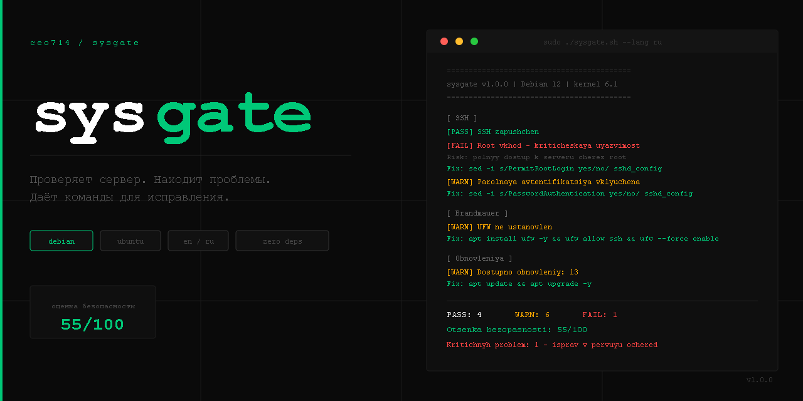

# sysgate



**Проверяет твой сервер и говорит что сломано — с готовыми командами для исправления.**


---

## Запустить

```bash
curl -sO https://raw.githubusercontent.com/ceo714/sysgate/main/linux/sysgate.sh
chmod +x sysgate.sh
sudo ./sysgate.sh --lang ru
```

Никакой установки. Один файл.

---

## Что делает

Запускаешь — получаешь отчёт по серверу. Что открыто, что настроено неправильно, что нужно исправить. По каждой проблеме — готовая команда. Скопировал, выполнил.

```
[ SSH ]
[PASS] SSH запущен
[FAIL] Root вход разрешён - критическая уязвимость
       Риск: полный доступ к серверу через root
       Исправить: sed -i 's/PermitRootLogin yes/PermitRootLogin no/' /etc/ssh/sshd_config && systemctl restart sshd
[WARN] Парольная аутентификация включена
       Исправить: sed -i 's/PasswordAuthentication yes/PasswordAuthentication no/' /etc/ssh/sshd_config && systemctl restart sshd

==========================================
PASS: 4   WARN: 6   FAIL: 1   INFO: 12
Оценка безопасности: 55/100
Критичных проблем: 1 - исправь в первую очередь
==========================================
Отчёт сохранён: sysgate-report-2026-03-22.txt
```

---

## Что проверяется

- **Система** - ОС, ядро, аптайм
- **Ресурсы** - CPU, RAM, диск, swap
- **Сеть** - открытые порты, слушающие сервисы
- **SSH** - порт, root-вход, парольная аутентификация
- **Брандмауэр** - UFW, iptables
- **Безопасность** - Fail2ban, права файлов, sudoers
- **Обновления** - доступные пакеты, автообновления
- **Входы** - последние 5 сессий

---

## Опции

```bash
sudo ./sysgate.sh --lang ru          # русский
sudo ./sysgate.sh --lang en          # english
sudo ./sysgate.sh --section ssh      # только один раздел
sudo ./sysgate.sh --no-save          # без сохранения отчёта
sudo ./sysgate.sh --help             # справка
```

Разделы: `system` `resources` `network` `ssh` `firewall` `security` `updates` `logins`

---

## Оценка безопасности

Каждый `[FAIL]` снимает 15 очков, `[WARN]` - 5. Итог от 0 до 100.

| Оценка | Статус |
|--------|--------|
| 90-100 | Хорошо |
| 70-89 | Нормально |
| 50-69 | Требует внимания |
| < 50 | Критично |

---

## Совместимость

Debian 11/12, Ubuntu 20.04 / 22.04 / 24.04. Windows Server - в планах.

---

## Связанные проекты

[win-baseline](https://github.com/ceo714/win-baseline) - оптимизация Windows 10/11  
[bye-tcp-internet](https://github.com/ceo714/bye-tcp-internet) - настройка TCP/IP стека

## Автор

**ceo714** - [GitHub](https://github.com/ceo714)

## Лицензия

MIT

---
---

## EN — English Documentation


**Checks your server and tells you what is broken — with ready-to-run fix commands.**

---

## Quick Start

```bash
curl -sO https://raw.githubusercontent.com/ceo714/sysgate/main/linux/sysgate.sh
chmod +x sysgate.sh
sudo ./sysgate.sh
```

No installation. No dependencies. One file.

---

## What it does

Run once — get a full server report. Every `[FAIL]` and `[WARN]` includes a ready-to-run fix command. Copy, paste, done.

```
[ SSH ]
[PASS] SSH is running
[FAIL] Root login permitted - critical vulnerability
       Risk: full server access directly via root
       Fix:  sed -i 's/PermitRootLogin yes/PermitRootLogin no/' /etc/ssh/sshd_config && systemctl restart sshd
[WARN] Password authentication enabled
       Fix:  sed -i 's/PasswordAuthentication yes/PasswordAuthentication no/' /etc/ssh/sshd_config && systemctl restart sshd

==========================================
PASS: 4   WARN: 6   FAIL: 1   INFO: 12
Security score: 55/100
Critical issues: 1 - fix these first
==========================================
Report saved: sysgate-report-2026-03-22.txt
```

---

## What gets checked

- **System** - OS, kernel, uptime
- **Resources** - CPU, RAM, disk, swap
- **Network** - open ports, listening services
- **SSH** - port, root login, password auth
- **Firewall** - UFW, iptables
- **Security** - Fail2ban, file permissions, sudoers
- **Updates** - available packages, unattended-upgrades
- **Logins** - last 5 sessions

---

## Options

```bash
sudo ./sysgate.sh                    # full audit, autodetect language
sudo ./sysgate.sh --lang en          # force English
sudo ./sysgate.sh --lang ru          # force Russian
sudo ./sysgate.sh --section ssh      # single section only
sudo ./sysgate.sh --no-save          # no report file
sudo ./sysgate.sh --help             # show help
```

Sections: `system` `resources` `network` `ssh` `firewall` `security` `updates` `logins`

---

## Security score

Each `[FAIL]` deducts 15 points. Each `[WARN]` deducts 5. Score from 0 to 100.

| Score | Status |
|-------|--------|
| 90-100 | Good |
| 70-89 | Acceptable |
| 50-69 | Needs attention |
| < 50 | Critical |

---

## Compatibility

Debian 11/12, Ubuntu 20.04 / 22.04 / 24.04. Windows Server - planned.

---

## Related projects

[win-baseline](https://github.com/ceo714/win-baseline) - Windows 10/11 performance baseline  
[bye-tcp-internet](https://github.com/ceo714/bye-tcp-internet) - TCP/IP network stack tuning

## Author

**ceo714** - [GitHub](https://github.com/ceo714)

## License

MIT
